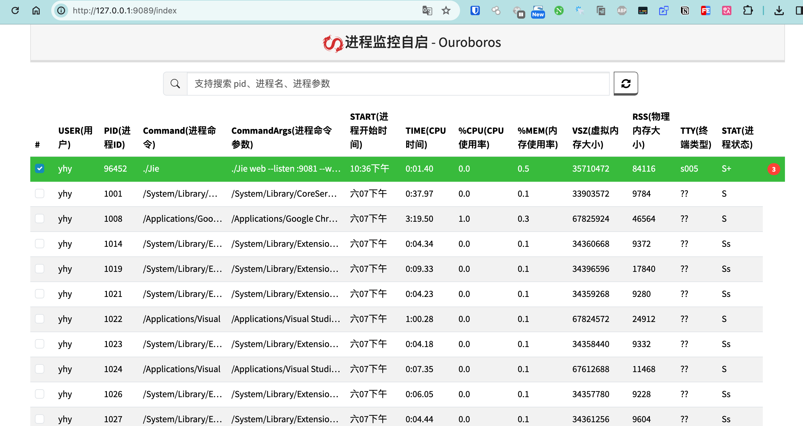

# Ouroboros

监控进程，当进程退出时自动重启进程。

## License

This code is distributed under the AGPL-3.0 license. See [LICENSE](https://github.com/yhy0/Ouroboros/blob/main/LICENSE) in this directory.

## 鸣谢

[JetBrains](https://www.jetbrains.com/)

## Star History

